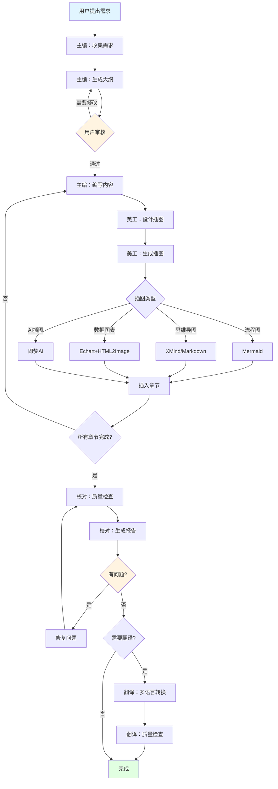

# 技术书籍写作系统

专业的技术书籍写作 Skill，采用多角色协同工作流，帮助用户创作高质量、零基础友好的技术入门书籍。

## 核心特性

- 🎯 **多角色协同**: 主编、校对、翻译、美工四个专业角色
- 📚 **标准化流程**: 大纲审核 → 内容编写 → 插图设计 → 质量校对
- 🎨 **多样化插图**: Mermaid流程图、XMind思维导图、Echart可视化、AI生成插图
- 🌍 **多语言支持**: 内置翻译角色，支持全书翻译
- ✅ **质量保证**: 严格的校对流程，确保内容准确无误

## 快速开始

当用户提出以下需求时，立即使用本 Skill：
- "我想写一本关于XXX的书"
- "帮我写一本XXX技术入门书籍"
- "生成XXX书籍大纲"
- "为书籍设计插图"
- "翻译这本书"

## 工作流程

### 阶段1: 需求收集与大纲设计 ⭐（必须等待用户审核）

**主编角色启动**

1. **收集写作需求**
   ```markdown
   必须询问的信息：
   - 书籍主题是什么？（如：机器学习、Go语言、Docker等）
   - 目标读者是谁？（零基础/有基础/进阶）
   - 预期达到什么效果？（入门/精通/实战）
   - 特殊要求？（写作风格、章节数、字数等）
   - 是否需要插图？需要哪些类型？
   - 是否需要翻译？翻译成什么语言？
   ```

2. **加载写作规范**
   - 自动读取 `技术书籍写作规范.md`（如果存在）
   - 如果不存在，使用内置的默认规范（见 [writing-standards.md](writing-standards.md)）

3. **生成书籍大纲**
   ```markdown
   大纲必须包含：
   - 全书目录结构（章节层级）
   - 每章核心内容概要
   - 预计字数和阅读时长
   - 代码示例数量
   - 插图需求列表（标注类型）
   - 测试题设计
   ```

4. **输出大纲文档**
   - 文件名格式：`{书籍主题}_书籍大纲.md`
   - 在文件中明确标注：**⚠️ 请审核大纲，审核通过后回复"开始写作"进入下一阶段**

5. **等待用户审核** ⛔
   - **重要**: 必须等待用户明确回复才能继续
   - 如用户要求修改，返回步骤3重新生成
   - 只有用户明确同意后，才能进入阶段2

---

### 阶段2: 内容创作与插图设计

**主编角色 + 美工角色并行工作**

#### 主编：章节内容编写

按照规范模板编写每章内容：

```markdown
# 第X章 章节标题

## 本章导读
- 要解决的问题
- 为什么重要
- 将掌握什么

## 核心概念
- 极简定义（一句话）
- 本质解释（类比）
- 应用场景

## 原理解析
[时序图/流程图占位符]
[对比表格]

## 实战案例
- 场景描述
- 完整可运行代码
- 逐行注释
- 运行结果
- 常见问题

## 本章小结
- 核心要点（3-5条）

## 章节测试
- 选择题（5题）
- 简答题（3题）
- 编程题（2题）

## 参考答案
[完整答案和解析]
```

**写作要点**:
- ✅ 极简表达，用日常语言
- ✅ 第一性原理出发
- ✅ 每个概念配代码示例
- ✅ 代码必须可直接运行
- ✅ 单章5000-8000字
- ❌ 避免学术术语堆砌
- ❌ 避免长篇理论推导

#### 美工：插图设计与生成

根据内容需求生成对应类型的插图：

##### 类型1: 时序图和流程图（Mermaid）

```markdown
直接在Markdown中插入Mermaid代码块：

\`\`\`mermaid
sequenceDiagram
    participant A as 用户
    participant B as 系统
    A->>B: 请求
    B-->>A: 响应
\`\`\`

或

\`\`\`mermaid
flowchart TD
    A[开始] --> B{判断}
    B -->|是| C[处理]
    B -->|否| D[跳过]
\`\`\`
```

##### 类型2: 思维导图（XMind或Markdown）

**方式A: 使用 Markdown 层级结构**
```markdown
# 知识体系
## 第一部分
### 章节1
- 知识点1
- 知识点2
### 章节2
## 第二部分
```

**方式B: 调用 XMind 脚本**（如果需要导出 .xmind 文件）
```bash
python scripts/generate_xmind.py \
  --input "大纲文件.md" \
  --output "思维导图.xmind"
```

##### 类型3: 数据可视化图表（Echart → HTML → JPG）

使用内置脚本生成：

```bash
# 1. 生成Echart HTML
python scripts/generate_echart.py \
  --type "bar|line|pie|scatter" \
  --data "data.json" \
  --title "图表标题" \
  --output "chart.html"

# 2. HTML转JPG
python scripts/html_to_image.py \
  --input "chart.html" \
  --output "chart.jpg" \
  --width 1200 \
  --height 800
```

支持的图表类型：
- 柱状图（bar）：对比数据
- 折线图（line）：趋势变化
- 饼图（pie）：占比分布
- 散点图（scatter）：数据分布
- 雷达图（radar）：多维度评估

##### 类型4: AI生成插图（即梦AI API）⚠️

**前提条件**: 用户必须提供火山引擎的 `ACCESS_KEY` 和 `SECRET_KEY`

**使用场景**: 
- 需要场景插图（如：数据中心、机器学习流程示意图）
- 概念可视化（抽象概念的形象化表达）
- 封面设计

**调用方式**:
```bash
python scripts/generate_ai_image.py \
  --prompt "一个现代化的数据中心，服务器机架，蓝色光线，科技感" \
  --ak "用户的ACCESS_KEY" \
  --sk "用户的SECRET_KEY" \
  --output "data_center.jpg"
```

**使用原则**:
- 🔴 **尽量少用**：优先使用 Mermaid、Echart 等结构化图表
- 🟡 **明确提示词**：提供详细的场景描述
- 🟢 **用户确认**：生成后让用户确认是否满意

**API文档**: https://www.volcengine.com/docs/85621/1537648?lang=zh

##### 类型5: 表格对比（Markdown）

```markdown
| 技术 | 优点 | 缺点 | 适用场景 |
|------|------|------|---------|
| 方案A | xxx | xxx | xxx |
| 方案B | xxx | xxx | xxx |
```

**插图命名规范**:
```
{章节号}_{插图类型}_{描述}.{扩展名}

示例：
- 01_flowchart_ml_workflow.png
- 03_sequence_training_process.png
- 05_echart_performance_comparison.jpg
- 02_ai_neural_network_concept.jpg
```

**插图存放路径**:
```
{书籍项目目录}/
├── chapters/
│   ├── chapter01.md
│   ├── chapter02.md
├── images/
│   ├── chapter01/
│   │   ├── 01_flowchart_xxx.png
│   │   └── 01_echart_xxx.jpg
│   ├── chapter02/
└── assets/
```

---

### 阶段3: 质量校对与审核

**校对角色启动**

使用内置校对脚本进行多维度检查：

```bash
# 运行完整校对流程
python scripts/proofreading.py \
  --input "chapters/" \
  --output "校对报告.md" \
  --checks "all"
```

#### 校对检查项

1. **内容准确性**
   - [ ] 技术概念描述正确
   - [ ] 代码示例无语法错误
   - [ ] 代码可以实际运行
   - [ ] 输出结果与描述一致

2. **结构完整性**
   - [ ] 章节结构符合模板
   - [ ] 必备章节都已包含（导读、概念、实战、测试）
   - [ ] 测试题数量正确（5+3+2）
   - [ ] 参考答案完整

3. **插图质量**
   - [ ] 所有插图引用正确
   - [ ] 图片文件存在且可访问
   - [ ] Mermaid 语法正确可渲染
   - [ ] 图表清晰易读

4. **代码质量**
   - [ ] 代码有完整注释
   - [ ] 包含必要的 import
   - [ ] 代码块不超过50行
   - [ ] 提供了运行结果

5. **语言风格**
   - [ ] 使用极简表达
   - [ ] 避免学术术语堆砌
   - [ ] 无错别字和语病
   - [ ] 符合阮一峰写作风格

6. **技术时效性**
   - [ ] 使用2025年主流技术栈
   - [ ] 框架版本标注清晰
   - [ ] 没有过时的技术方案

#### 自动化校对

运行代码验证脚本：
```bash
# 验证所有代码示例
python scripts/validate_code.py \
  --chapters "chapters/" \
  --language "python|go|javascript"
```

#### 输出校对报告

校对完成后生成报告：
```markdown
# 校对报告

## 整体评估
- 总章节数: XX
- 检查通过: XX
- 需要修改: XX
- 严重问题: XX

## 问题清单

### 第1章
- ❌ 代码示例缺少import语句（行123）
- ⚠️ 建议补充对比表格
- ✅ 其他检查通过

### 第2章
...

## 修改建议
[具体的修改意见]
```

#### 修复问题

根据校对报告修复所有问题，然后重新运行校对直到全部通过。

---

### 阶段4: 多语言翻译（可选）

**翻译角色启动**

如果用户需要翻译，执行以下流程：

1. **确认翻译需求**
   ```markdown
   - 目标语言？（英语/日语/韩语等）
   - 翻译范围？（全书/部分章节）
   - 是否翻译代码注释？
   - 专业术语处理方式？（保留原文/翻译/双语）
   ```

2. **执行翻译**
   ```bash
   python scripts/translate_book.py \
     --input "chapters/" \
     --output "translations/en/" \
     --target-lang "en" \
     --keep-terms "术语表.json"
   ```

3. **术语一致性**
   - 使用术语表确保翻译一致
   - 技术术语优先保留英文
   - 关键概念采用双语标注

4. **代码处理**
   - 代码本身不翻译
   - 注释翻译为目标语言
   - 变量名保持原样

5. **质量检查**
   - 翻译后运行校对脚本
   - 确保Markdown格式正确
   - 验证插图引用路径

---

## 项目结构

完整的书籍项目结构：

```
{书籍名称}/
├── README.md                    # 书籍介绍
├── 书籍大纲.md                  # 完整大纲
├── 写作规范.md                  # 写作标准
├── chapters/                    # 章节内容
│   ├── chapter01.md
│   ├── chapter02.md
│   └── ...
├── images/                      # 插图资源
│   ├── chapter01/
│   ├── chapter02/
│   └── ...
├── code/                        # 代码示例
│   ├── chapter01/
│   │   ├── example01.py
│   │   └── README.md
│   └── ...
├── tests/                       # 测试题
│   ├── chapter01_test.md
│   ├── chapter01_answer.md
│   └── ...
├── translations/                # 多语言版本
│   ├── en/
│   ├── ja/
│   └── ...
├── appendix/                    # 附录
│   ├── glossary.md             # 术语表
│   ├── resources.md            # 资源推荐
│   └── faq.md                  # 常见问题
└── reports/                     # 质量报告
    ├── 校对报告.md
    └── 进度跟踪.md
```

---

## 辅助工具脚本

本 Skill 提供以下实用脚本（位于 `scripts/` 目录）：

| 脚本 | 功能 | 用法 |
|------|------|------|
| `generate_outline.py` | 根据主题自动生成大纲 | 见 [scripts-guide.md](scripts-guide.md) |
| `generate_xmind.py` | Markdown转XMind思维导图 | 见下方示例 |
| `generate_echart.py` | 生成Echart可视化图表 | 见下方示例 |
| `html_to_image.py` | HTML转图片（JPG/PNG） | 见下方示例 |
| `generate_ai_image.py` | 调用即梦AI生成插图 | 需要AK/SK |
| `proofreading.py` | 全书质量校对 | 自动化检查 |
| `validate_code.py` | 验证代码示例可运行性 | 支持多语言 |
| `translate_book.py` | 全书翻译 | 支持多目标语言 |
| `generate_pdf.py` | 导出PDF格式电子书 | 见 [export-guide.md](export-guide.md) |

**快速查看脚本使用方法**:
```bash
python scripts/{脚本名}.py --help
```

---

## 角色协同示例

### 场景1: 创作机器学习入门书籍

```
用户: "我想写一本机器学习入门书籍"

【主编角色】
1. 收集需求：目标读者、章节数、特殊要求
2. 生成大纲：16章完整规划
3. 输出：机器学习入门_书籍大纲.md
4. ⏸️ 等待用户审核

用户: "大纲不错，开始写作"

【主编 + 美工并行】
主编：编写第1章内容
美工：生成流程图（Mermaid）、对比表（Markdown）

主编：编写第2章内容  
美工：生成思维导图（XMind）、Echart图表

...循环直到完成所有章节

【校对角色】
1. 运行 proofreading.py 检查全书
2. 运行 validate_code.py 验证代码
3. 生成校对报告
4. 修复所有问题

【翻译角色】（如果需要）
1. 翻译为英文版本
2. 保持术语一致性
3. 质量检查

✅ 完成！
```

### 场景2: 为现有章节添加插图

```
用户: "帮我为第3章生成插图"

【美工角色】
1. 读取第3章内容
2. 识别需要插图的位置
3. 根据类型生成：
   - 算法流程 → Mermaid流程图
   - 性能对比 → Echart柱状图
   - 概念关系 → 思维导图
   - 场景示意 → （如果用户提供AK/SK）即梦AI
4. 插入图片引用到章节
5. 输出图片到 images/chapter03/
```

### 场景3: 全书质量检查

```
用户: "检查一下书籍质量"

【校对角色】
1. 扫描所有章节
2. 检查结构完整性
3. 验证代码可运行
4. 检查插图引用
5. 语言风格审查
6. 生成详细报告

输出：校对报告.md
```

---

## 质量标准检查清单

每章完成后必须通过以下检查：

### 内容质量
- [ ] 核心概念一句话定义
- [ ] 包含类比解释
- [ ] 至少2个代码示例
- [ ] 代码可直接运行
- [ ] 代码有详细注释
- [ ] 包含运行结果

### 结构完整性
- [ ] 有本章导读
- [ ] 有核心概念章节
- [ ] 有原理解析章节
- [ ] 有实战案例
- [ ] 有本章小结
- [ ] 有测试题（5+3+2）
- [ ] 有参考答案

### 可视化
- [ ] 至少1个时序图/流程图
- [ ] 至少1个对比表格
- [ ] 插图清晰易懂
- [ ] 图片文件存在

### 语言风格
- [ ] 使用极简表达
- [ ] 避免学术术语
- [ ] 单章5000-8000字
- [ ] 段落简短（≤5行）

### 技术准确性
- [ ] 使用2025年技术栈
- [ ] 版本号标注清晰
- [ ] 无过时的技术方案
- [ ] 代码通过语法检查

---

## 常见问题

### Q1: 如何调整章节数量？
在大纲设计阶段，根据书籍复杂度调整：
- 语言入门：12-15章
- 技术框架：10-12章
- 综合实战：15-18章

### Q2: 代码示例应该多详细？
- 每个代码块不超过50行
- 必须包含完整的 import
- 关键步骤必须注释
- 提供实际运行结果

### Q3: 什么时候使用AI生成插图？
- 需要场景化插图时
- 抽象概念需要可视化时
- **前提**: 用户提供了 AK/SK
- **原则**: 优先使用结构化图表

### Q4: 如何保证翻译质量？
- 使用术语表保持一致性
- 技术术语优先保留英文
- 翻译后运行校对脚本
- 代码注释翻译但代码本身不变

### Q5: 校对报告发现问题怎么办？
1. 查看具体问题描述
2. 修改对应章节
3. 重新运行校对
4. 直到全部通过

---

## 进阶功能

### 自定义写作规范

如果需要特定的写作风格：

1. 在项目根目录创建 `custom_standards.md`
2. 定义你的章节模板、代码规范、插图要求
3. 主编角色会自动加载自定义规范

### 批量生成章节

```bash
# 根据大纲批量生成章节框架
python scripts/batch_generate.py \
  --outline "书籍大纲.md" \
  --output "chapters/"
```

### 导出电子书

```bash
# 导出为PDF
python scripts/generate_pdf.py \
  --input "chapters/" \
  --output "book.pdf" \
  --style "modern|classic"

# 导出为EPUB
python scripts/generate_epub.py \
  --input "chapters/" \
  --output "book.epub"
```

---

## 工作流程图



---

## 总结

使用本 Skill 可以：

✅ **标准化流程**: 从大纲到成书的完整流程
✅ **多角色协同**: 主编、美工、校对、翻译各司其职
✅ **质量保证**: 自动化校对，确保内容准确
✅ **丰富插图**: 多种类型插图，提升阅读体验
✅ **高效创作**: 脚本辅助，提升创作效率
✅ **可扩展性**: 支持自定义规范和导出格式

开始创作你的第一本技术书籍吧！🚀
