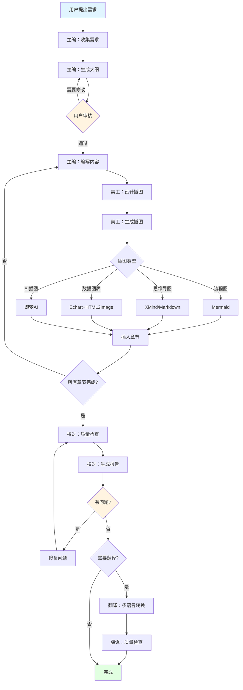

# 技术书籍写作系统

专业的技术书籍写作 Skill，采用多角色协同工作流，帮助用户创作高质量、零基础友好的技术入门书籍。

## 核心特性

- 🎯 **多角色协同**: 主编、校对、翻译、美工四个专业角色
- 📚 **标准化流程**: 大纲审核 → 内容编写 → 插图设计 → 质量校对
- 🎨 **多样化插图**: Mermaid流程图、XMind思维导图、Echart可视化、AI生成插图
- 🌍 **多语言支持**: 内置翻译角色，支持全书翻译
- ✅ **质量保证**: 严格的校对流程，确保内容准确无误
- 📁 **规范化结构**: 严格的目录组织和素材管理规范

## 环境配置

### 即梦AI 凭证配置（可选）

如果需要使用即梦AI生成插图，需要配置火山引擎的访问凭证。提供三种配置方式（按优先级排序）：

#### 方式1: 交互式配置（推荐）

首次使用时运行 setup 命令：

```bash
python scripts/generate_ai_image.py --setup
```

按提示输入 ACCESS_KEY 和 SECRET_KEY，凭证将安全保存到 `~/.tech-book-writer/config.json`。

**获取凭证地址**: https://console.volcengine.com/iam/keymanage/

#### 方式2: 环境变量

在 `~/.zshrc` 或 `~/.bashrc` 中添加：

```bash
export VOLCENGINE_ACCESS_KEY='your_access_key'
export VOLCENGINE_SECRET_KEY='your_secret_key'
```

然后执行 `source ~/.zshrc` 或重启终端。

#### 方式3: 命令行参数

每次调用时手动传入：

```bash
python scripts/generate_ai_image.py --ak YOUR_AK --sk YOUR_SK ...
```

**注意**: 方式1和2配置后，后续使用时脚本会自动读取凭证，无需重复输入。

## 快速开始

当用户提出以下需求时，立即使用本 Skill：
- "我想写一本关于XXX的书"
- "帮我写一本XXX技术入门书籍"
- "生成XXX书籍大纲"
- "为书籍设计插图"
- "翻译这本书"

## 工作流程

### 阶段1: 需求收集与大纲设计 ⭐（必须等待用户审核）

**主编角色启动**

1. **收集写作需求**
   ```markdown
   必须询问的信息：
   - 书籍主题是什么？（如：机器学习、Go语言、Docker等）
   - 目标读者是谁？（零基础/有基础/进阶）
   - 预期达到什么效果？（入门/精通/实战）
   - 特殊要求？（写作风格、章节数、字数等）
   - 是否需要插图？需要哪些类型？
   - 是否需要翻译？翻译成什么语言？
   ```

2. **加载写作规范**
   - 自动读取 `技术书籍写作规范.md`（如果存在）
   - 如果不存在，使用内置的默认规范（见 [writing-standards.md](writing-standards.md)）

3. **生成书籍大纲**
   ```markdown
   大纲必须包含：
   - 全书目录结构（章节层级）
   - 每章核心内容概要
   - 预计字数和阅读时长
   - 代码示例数量
   - 插图需求列表（标注类型）
   - 测试题设计
   ```

4. **输出大纲文档**
   - 文件名格式：`{书籍主题}_书籍大纲.md`
   - 在文件中明确标注：**⚠️ 请审核大纲，审核通过后回复"开始写作"进入下一阶段**

5. **等待用户审核** ⛔
   - **重要**: 必须等待用户明确回复才能继续
   - 如用户要求修改，返回步骤3重新生成
   - 只有用户明确同意后，才能进入阶段2

---

### 阶段2: 内容创作与插图设计

**主编角色 + 美工角色并行工作**

#### 主编：章节内容编写

**⚠️ 重要原则：严格遵循大纲 + 规范化目录结构**

在开始写作前，必须：

1. **严格按照大纲的章节规划写作**
   - 每章的标题必须与大纲一致
   - 每章的核心内容必须紧扣大纲中规划的主题
   - 不得随意添加大纲中不存在的章节
   - 不得省略大纲中规划的核心内容

2. **保持内容与大纲的一致性**
   - 定期对照大纲检查内容是否偏离主线
   - 发现偏离时立即调整，回归大纲规划
   - 如需调整大纲，必须先与用户确认

3. **⚠️ 严格按照目录结构组织素材（最重要！）**
   - 所有图片必须存放到 `assets/chapterXX/images/` 目录
   - 所有代码必须存放到 `assets/chapterXX/code/` 目录
   - 所有HTML/图表必须存放到 `assets/chapterXX/html/` 目录
   - 所有数据文件必须存放到 `assets/chapterXX/data/` 目录
   - **禁止**将图片散落在chapters目录或项目根目录
   - **禁止**随意命名图片文件，必须遵循命名规范

4. **避免常见问题**
   - ❌ **随意扩展**：在大纲之外增加大量内容
   - ❌ **偏离主题**：写作时忘记大纲规划的主题
   - ❌ **结构混乱**：不按照大纲的章节顺序写作
   - ❌ **素材散落**：图片、代码随意存放，不按目录组织
   - ✅ **紧扣大纲**：每章内容都是大纲的精确实现
   - ✅ **规范目录**：所有素材按章节分类存放

按照规范模板编写每章内容：

```markdown
# 第X章 章节标题

## 本章导读
- 要解决的问题
- 为什么重要
- 将掌握什么

## 核心概念
- 极简定义（一句话）
- 本质解释（类比）
- 应用场景

## 原理解析
[时序图/流程图占位符]
[对比表格]

## 实战案例
- 场景描述
- 完整可运行代码
- 逐行注释
- 运行结果
- 常见问题

## 本章小结
- 核心要点（3-5条）

## 章节测试
- 选择题（5题）
- 简答题（3题）
- 编程题（2题）

## 参考答案
[完整答案和解析]
```

**写作要点**:
- ⚠️ **严格遵循大纲**：每章必须严格按照审核通过的大纲编写，不得偏离主线
- ⚠️ **代码必须可编译运行**：所有代码示例必须保存为独立文件，通过编译/解释验证，无语法错误
- ⚠️ **素材按章节组织**：所有图片、代码、HTML等素材必须按章节存放到 `assets/chapterXX/` 对应目录
- ✅ 极简表达，用日常语言
- ✅ 第一性原理出发
- ✅ 每个概念配代码示例
- ✅ 单章5000-8000字
- ❌ 避免学术术语堆砌
- ❌ 避免长篇理论推导
- ❌ 禁止随意扩展大纲外内容
- ❌ 禁止使用无法运行的代码示例

#### 美工：插图设计与生成

根据内容需求生成对应类型的插图：

##### 类型1: 时序图和流程图（Mermaid）

```markdown
直接在Markdown中插入Mermaid代码块：

\`\`\`mermaid
sequenceDiagram
    participant A as 用户
    participant B as 系统
    A->>B: 请求
    B-->>A: 响应
\`\`\`

或

\`\`\`mermaid
flowchart TD
    A[开始] --> B{判断}
    B -->|是| C[处理]
    B -->|否| D[跳过]
\`\`\`
```

##### 类型2: 思维导图（XMind或Markdown）

**方式A: 使用 Markdown 层级结构**
```markdown
# 知识体系
## 第一部分
### 章节1
- 知识点1
- 知识点2
### 章节2
## 第二部分
```

**方式B: 调用 XMind 脚本**（如果需要导出 .xmind 文件）
```bash
python scripts/generate_xmind.py \
  --input "大纲文件.md" \
  --output "思维导图.xmind"
```

##### 类型3: 数据可视化图表（Echart → HTML → JPG）

使用内置脚本生成：

```bash
# 1. 生成Echart HTML
python scripts/generate_echart.py \
  --type "bar|line|pie|scatter" \
  --data "data.json" \
  --title "图表标题" \
  --output "chart.html"

# 2. HTML转JPG
python scripts/html_to_image.py \
  --input "chart.html" \
  --output "chart.jpg" \
  --width 1200 \
  --height 800
```

支持的图表类型：
- 柱状图（bar）：对比数据
- 折线图（line）：趋势变化
- 饼图（pie）：占比分布
- 散点图（scatter）：数据分布
- 雷达图（radar）：多维度评估

##### 类型4: AI生成插图（即梦AI API）⭐

**前提条件**: 需要配置火山引擎访问凭证（见上方"环境配置"章节）

**使用场景**:
- 章节封面插图（每章一张16:9横版配图）
- 概念场景可视化（将抽象概念转化为直观场景）
- 技术场景营造（营造与章节主题相符的氛围）

**⚠️ 重要规范：16:9横版风格 + 专业提示词**

所有AI生成的插图必须遵循以下规范：

1. **尺寸规范**：
   - **推荐使用 16:9 横版**（横版宽幅）
   - 2K尺寸：2560x1440（推荐，速度较快）
   - 4K尺寸：5404x3040（高清，文件较大）
   - 使用 `--preset "16:9" --size 2k` 参数

2. **提示词风格**：
   采用极简低饱和度专业风格，参考模板：
   ```
   极简[主题]山水，浅[色系1]浅[色系2]低饱和色系，远山淡墨晕染，
   云雾如纱缠绕山峦，[具体场景细节]，留白充足，
   水墨写意质感，空灵静谧，[意境/哲学]意境，
   横版宽幅，高清细节
   ```

3. **根据章节主题定制**：
   - 机器学习：现代科技山水，浅蓝浅灰，神经网络山峰，数据流动云雾
   - 编程语言：代码竹林，浅绿浅青，函数枝桡，算法溪流，逻辑意境
   - 数据库：数据湖景，浅蓝浅紫，信息岛屿，查询波光，存储意境
   - 网络安全：守护山脉，浅金浅灰，防护城墙，加密云雾，安全意境
   - 云原生：云端梯田，浅白浅蓝，容器方格，服务流水，弹性意境

**调用示例**：
```bash
# 机器学习章节封面（推荐：16:9横版2K）
python scripts/generate_ai_image.py \
  --prompt "极简机器学习山水，浅蓝浅灰低饱和色系，远山淡墨晕染，云雾如纱缠绕山峦，山脚下神经网络如树般生长，数据流如溪水穿过山谷，留白充足，水墨写意质感，空灵静谧，智能意境，横版宽幅，高清细节" \
  --preset "16:9" --size 2k \
  --output "assets/chapter01/images/01_cover_ml.jpg"

# 编程语言章节封面
python scripts/generate_ai_image.py \
  --prompt "极简代码竹林，浅绿浅青低饱和色系，远山淡墨晕染，云雾如纱缠绕竹林，函数枝桡向上生长，算法溪流穿过竹林，留白充足，水墨写意质感，空灵静谧，逻辑意境，横版宽幅，高清细节" \
  --preset "16:9" --size 2k \
  --output "assets/chapter02/images/01_cover_coding.jpg"

# 自定义尺寸（4K 16:9）
python scripts/generate_ai_image.py \
  --prompt "山水画" \
  --width 5404 --height 3040 \
  --output "custom.jpg"
```

**图片存放路径**（必须遵守）：
```
assets/chapterXX/images/
├── 01_cover_[主题].jpg           # 章节封面（16:9横版2560x1440）
├── 02_scene_[概念].jpg           # 场景插图
└── README.md                     # 图片说明文档
```

**使用原则**:
- 🟢 **章节封面**：每章生成一张16:9横版封面
- 🟡 **场景配图**：重要概念可添加场景可视化
- 🔴 **控制数量**：不要过度使用，保持书籍专业感
- ✅ **用户确认**：生成后必须让用户确认效果

##### 类型5: 表格对比（Markdown）

```markdown
| 技术 | 优点 | 缺点 | 适用场景 |
|------|------|------|---------|
| 方案A | xxx | xxx | xxx |
| 方案B | xxx | xxx | xxx |
```

**插图命名规范**:
```
{章节号}_{插图类型}_{描述}.{扩展名}

示例：
- 01_flowchart_ml_workflow.png
- 03_sequence_training_process.png
- 05_echart_performance_comparison.jpg
- 02_ai_neural_network_concept.jpg
```

**插图存放路径**:
```
{书籍项目目录}/
├── chapters/
│   ├── chapter01.md
│   ├── chapter02.md
├── images/
│   ├── chapter01/
│   │   ├── 01_flowchart_xxx.png
│   │   └── 01_echart_xxx.jpg
│   ├── chapter02/
└── assets/
```

---

### 阶段3: 质量校对与审核

**校对角色启动**

使用内置校对脚本进行多维度检查：

```bash
# 运行完整校对流程
python scripts/proofreading.py \
  --input "chapters/" \
  --output "校对报告.md" \
  --checks "all"
```

#### 校对检查项

1. **内容准确性**
   - [ ] 技术概念描述正确
   - [ ] 代码示例无语法错误
   - [ ] 代码可以实际运行
   - [ ] 输出结果与描述一致

2. **结构完整性**
   - [ ] 章节结构符合模板
   - [ ] 必备章节都已包含（导读、概念、实战、测试）
   - [ ] 测试题数量正确（5+3+2）
   - [ ] 参考答案完整

3. **插图质量**
   - [ ] 所有插图引用正确
   - [ ] 图片文件存在且可访问
   - [ ] Mermaid 语法正确可渲染
   - [ ] 图表清晰易读

4. **代码质量**
   - [ ] 代码有完整注释
   - [ ] 包含必要的 import
   - [ ] 代码块不超过50行
   - [ ] 提供了运行结果

5. **语言风格**
   - [ ] 使用极简表达
   - [ ] 避免学术术语堆砌
   - [ ] 无错别字和语病
   - [ ] 符合阮一峰写作风格

6. **技术时效性**
   - [ ] 使用2025年主流技术栈
   - [ ] 框架版本标注清晰
   - [ ] 没有过时的技术方案

#### 自动化校对

运行代码验证脚本：
```bash
# 验证所有代码示例
python scripts/validate_code.py \
  --chapters "chapters/" \
  --language "python|go|javascript"
```

#### 输出校对报告

校对完成后生成报告：
```markdown
# 校对报告

## 整体评估
- 总章节数: XX
- 检查通过: XX
- 需要修改: XX
- 严重问题: XX

## 问题清单

### 第1章
- ❌ 代码示例缺少import语句（行123）
- ⚠️ 建议补充对比表格
- ✅ 其他检查通过

### 第2章
...

## 修改建议
[具体的修改意见]
```

#### 修复问题

根据校对报告修复所有问题，然后重新运行校对直到全部通过。

---

### 阶段4: 多语言翻译（可选）

**翻译角色启动**

如果用户需要翻译，执行以下流程：

1. **确认翻译需求**
   ```markdown
   - 目标语言？（英语/日语/韩语等）
   - 翻译范围？（全书/部分章节）
   - 是否翻译代码注释？
   - 专业术语处理方式？（保留原文/翻译/双语）
   ```

2. **执行翻译**
   ```bash
   python scripts/translate_book.py \
     --input "chapters/" \
     --output "translations/en/" \
     --target-lang "en" \
     --keep-terms "术语表.json"
   ```

3. **术语一致性**
   - 使用术语表确保翻译一致
   - 技术术语优先保留英文
   - 关键概念采用双语标注

4. **代码处理**
   - 代码本身不翻译
   - 注释翻译为目标语言
   - 变量名保持原样

5. **质量检查**
   - 翻译后运行校对脚本
   - 确保Markdown格式正确
   - 验证插图引用路径

---

### 阶段5: 生成总结卡片（可选）

**美工角色 + 主编角色**

为完成的章节添加技术文章总结卡片，方便读者快速回顾和分享。

#### 触发方式

总结卡片**默认不自动生成**，需要用户主动触发：

```markdown
用户提示词示例：
- "为第1章生成总结卡片"
- "添加文章总结组件"
- "帮我生成分享卡片"
```

#### 生成方式

使用脚本自动生成并插入到文章末尾：

```bash
# 基础用法
python scripts/generate_share_card.py \
  --input "chapters/chapter01.md"

# 指定分享链接
python scripts/generate_share_card.py \
  --input "chapters/chapter01.md" \
  --share-url "https://your-book.com/chapter01"

# 预览卡片（不写入文件）
python scripts/generate_share_card.py \
  --input "chapters/chapter01.md" \
  --preview

# 更新已有卡片的分享链接
python scripts/generate_share_card.py \
  --input "chapters/chapter01.md" \
  --share-url "https://your-book.com/chapter01" \
  --update
```

#### 卡片功能

脚本会自动分析文章内容，提取：
- 📌 **文章标题**：从第一个 # 标题提取
- 📝 **文章摘要**：自动生成简短摘要
- 💡 **核心要点**：提取 3-5 条关键内容（加粗文本、列表项）
- 🏷️ **技术标签**：识别技术关键词
- 📅 **发布日期**：自动添加当前日期

#### 卡片样式

- 清新技术风格（蓝紫渐变配色）
- 圆角卡片 + 柔和阴影
- 编号要点列表
- 响应式设计（完美适配 PC 和移动端）
- 纯 HTML + CSS，支持在 Markdown 渲染器中显示

#### 功能按钮

- **复制链接**：点击按钮复制文章链接到剪贴板
- **导出图片**：
  - 方式1：使用系统截图工具（Mac: Cmd+Shift+4，Windows: Win+Shift+S）
  - 方式2：安装 html2canvas 库后可一键导出

#### 分享链接配置

默认使用占位符链接，用户可以通过以下方式修改：

**方式1**: 运行脚本时指定 `--share-url`

**方式2**: 发送链接给 AI，AI 帮你更新
```markdown
用户: "分享链接是 https://example.com/ch01，帮我更新"

AI: 执行脚本更新卡片链接...
```

**方式3**: 手动编辑文章，查找 `copyArticleLink` 函数并修改链接

---

## 项目结构（重要！）

⚠️ **这是最重要的部分！严格遵循以下目录结构。**

完整的书籍项目结构：

```
{书籍名称}/
├── README.md                    # 书籍介绍
├── 书籍大纲.md                  # 完整大纲（用户审核通过后锁定）
├── 写作规范.md                  # 写作标准（可选）
├── chapters/                    # ✅ 章节内容（仅Markdown文件）
│   ├── chapter01.md
│   ├── chapter02.md
│   └── ...
├── assets/                      # 📁 所有素材资源（严格按章节组织）
│   │
│   ├── chapter01/               # 第1章的所有素材
│   │   ├── images/             # 📷 图片资源目录
│   │   │   ├── 01_cover_ml.jpg                  # 章节封面（16:9横版2560x1440）
│   │   │   ├── 02_flowchart_ml_workflow.png     # Mermaid流程图
│   │   │   ├── 03_echart_performance.jpg        # Echart图表
│   │   │   ├── 04_scene_concept.jpg             # AI场景插图
│   │   │   └── README.md                          # 图片说明文档
│   │   │
│   │   ├── code/               # 💻 可运行的代码示例
│   │   │   ├── example01_linear_regression.py
│   │   │   ├── example02_data_processing.py
│   │   │   └── README.md                          # 代码使用说明
│   │   │
│   │   ├── html/               # 🌐 HTML/图表资源
│   │   │   ├── chart01_performance.html          # Echart图表源文件
│   │   │   ├── chart01_performance.jpg           # 导出的JPG图片
│   │   │   └── README.md
│   │   │
│   │   └── data/               # 📊 数据文件
│   │       ├── training_data.csv
│   │       └── config.json
│   │
│   ├── chapter02/               # 第2章的所有素材
│   │   ├── images/
│   │   ├── code/
│   │   ├── html/
│   │   └── data/
│   │
│   └── ...
│
├── tests/                       # 测试题
│   ├── chapter01_test.md
│   ├── chapter01_answer.md
│   └── ...
├── translations/                # 多语言版本
│   ├── en/
│   ├── ja/
│   └── ...
├── appendix/                    # 附录
│   ├── glossary.md             # 术语表
│   ├── resources.md            # 资源推荐
│   └── faq.md                  # 常见问题
└── reports/                     # 质量报告
    ├── 校对报告.md
    └── 进度跟踪.md
```

### ⚠️⚠️⚠️ 目录结构规范（必须遵守）

**铁律1: chapters目录只存放Markdown文件**
- ✅ `chapters/chapter01.md` - 章节内容
- ❌ `chapters/image01.png` - 禁止！图片必须放assets目录
- ❌ `chapters/code.py` - 禁止！代码必须放assets目录

**铁律2: 所有素材必须按章节分类**
- ✅ `assets/chapter01/images/xxx.png` - 正确
- ❌ `assets/images/xxx.png` - 错误！没有按章节组织
- ❌ `images/xxx.png` - 错误！应该在assets目录下

**铁律3: 素材必须分类存放**
- 图片 → `assets/chapterXX/images/`
- 代码 → `assets/chapterXX/code/`
- HTML → `assets/chapterXX/html/`
- 数据 → `assets/chapterXX/data/`

**铁律4: 命名必须规范**
```
{章节号}_{类型序号}_{描述}.{扩展名}

示例：
✅ 01_cover_ml.jpg              # 第1章封面
✅ 01_flowchart_workflow.png    # 第1章第1个流程图
✅ 01_echart_performance.jpg   # 第1章第1个图表
✅ 01_example01_lr.py          # 第1章第1个代码示例
✅ 01_chart01_data.html        # 第1章第1个HTML图表

❌ cover.jpg                    # 缺少章节号
❌ ml_flowchart.png            # 缺少序号
❌ image001.png                # 无意义命名
```

### ⚠️ 素材存放规则

**1. 必须按章节组织**
- 每章的所有素材必须放在 `assets/chapterXX/` 目录下
- 图片、代码、HTML、数据文件分别存放在对应的子目录

**2. 命名规范**
```
{章节号}_{类型}_{描述}.{扩展名}

示例：
- 01_flowchart_ml_workflow.png        # 第1章流程图
- 01_echart_performance.jpg            # 第1章数据图表
- 01_ai_neural_network.jpg             # 第1章AI插图
- 01_example01_linear_regression.py    # 第1章代码示例1
- 01_chart01_performance.html          # 第1章图表HTML
```

**3. 代码示例必须可运行**
- ✅ 每个代码示例必须保存为独立文件
- ✅ 文件必须可以通过编译/解释运行
- ✅ 无语法错误，无依赖缺失
- ✅ 包含完整的注释和说明

**4. README文件**
- 每个素材子目录应包含 README.md 说明文件
- 记录素材用途、生成方式、依赖关系等

**5. 文章中引用素材**
```markdown
# 正确的引用方式


# 代码示例
详细代码见：[example01.py](../assets/chapter01/code/example01_linear_regression.py)
```

---

## 辅助工具脚本

本 Skill 提供以下实用脚本（位于 `scripts/` 目录）：

| 脚本 | 功能 | 用法 |
|------|------|------|
| `generate_outline.py` | 根据主题自动生成大纲 | 见 [scripts-guide.md](scripts-guide.md) |
| `generate_xmind.py` | Markdown转XMind思维导图 | 见下方示例 |
| `generate_echart.py` | 生成Echart可视化图表 | 见下方示例 |
| `html_to_image.py` | HTML转图片（JPG/PNG） | 见下方示例 |
| `generate_ai_image.py` | 调用即梦AI生成插图 | 见"环境配置"章节 |
| `proofreading.py` | 全书质量校对 | 自动化检查 |
| `validate_code.py` | 验证代码示例可运行性 | 支持多语言 |
| `translate_book.py` | 全书翻译 | 支持多目标语言 |
| `generate_pdf.py` | 导出PDF格式电子书 | 见 [export-guide.md](export-guide.md) |
| `generate_share_card.py` | 生成技术文章总结卡片 | 见"阶段5: 生成总结卡片" |

**快速查看脚本使用方法**:
```bash
python scripts/{脚本名}.py --help
```

---

## 角色协同示例

### 场景1: 创作机器学习入门书籍

```
用户: "我想写一本机器学习入门书籍"

【主编角色】
1. 收集需求：目标读者、章节数、特殊要求
2. 生成大纲：16章完整规划
3. 输出：机器学习入门_书籍大纲.md
4. ⏸️ 等待用户审核

用户: "大纲不错，开始写作"

【主编 + 美工并行】
主编：编写第1章内容
美工：生成流程图（Mermaid）、对比表（Markdown）

主编：编写第2章内容  
美工：生成思维导图（XMind）、Echart图表

...循环直到完成所有章节

【校对角色】
1. 运行 proofreading.py 检查全书
2. 运行 validate_code.py 验证代码
3. 生成校对报告
4. 修复所有问题

【翻译角色】（如果需要）
1. 翻译为英文版本
2. 保持术语一致性
3. 质量检查

✅ 完成！
```

### 场景2: 为现有章节添加插图

```
用户: "帮我为第3章生成插图"

【美工角色】
1. 读取第3章内容
2. 识别需要插图的位置
3. 根据类型生成：
   - 算法流程 → Mermaid流程图
   - 性能对比 → Echart柱状图
   - 概念关系 → 思维导图
   - 场景示意 → （如果已配置凭证）即梦AI
4. 插入图片引用到章节
5. 输出图片到 images/chapter03/
```

### 场景3: 全书质量检查

```
用户: "检查一下书籍质量"

【校对角色】
1. 扫描所有章节
2. 检查结构完整性
3. 验证代码可运行
4. 检查插图引用
5. 语言风格审查
6. 生成详细报告

输出：校对报告.md
```

---

## 质量标准检查清单

每章完成后必须通过以下检查：

### ⚠️ 大纲一致性（最重要）
- [ ] 章节标题与大纲完全一致
- [ ] 核心内容紧扣大纲规划的主题
- [ ] 无大纲之外随意添加的内容
- [ ] 无大纲中规划但缺失的内容
- [ ] 章节顺序与大纲保持一致

### 内容质量
- [ ] 核心概念一句话定义
- [ ] 包含类比解释
- [ ] 至少2个代码示例
- [ ] 代码可直接运行
- [ ] 代码有详细注释
- [ ] 包含运行结果

### 结构完整性
- [ ] 有本章导读
- [ ] 有核心概念章节
- [ ] 有原理解析章节
- [ ] 有实战案例
- [ ] 有本章小结
- [ ] 有测试题（5+3+2）
- [ ] 有参考答案

### 可视化
- [ ] 至少1个时序图/流程图
- [ ] 至少1个对比表格
- [ ] 插图清晰易懂
- [ ] 图片文件存在

### 语言风格
- [ ] 使用极简表达
- [ ] 避免学术术语
- [ ] 单章5000-8000字
- [ ] 段落简短（≤5行）

### 技术准确性
- [ ] 使用2025年技术栈
- [ ] 版本号标注清晰
- [ ] 无过时的技术方案

### ⚠️ 代码质量（必须验证）
- [ ] 所有代码示例已保存为独立文件到 `assets/chapterXX/code/`
- [ ] 代码文件通过编译/解释器验证，无语法错误
- [ ] 代码可以直接运行，产生预期输出
- [ ] 包含完整的依赖和导入语句
- [ ] 有详细的代码注释
- [ ] 代码块中显示的输出与实际运行结果一致

### 素材组织规范
- [ ] 所有图片存放在 `assets/chapterXX/images/`
- [ ] 图片命名符合规范（章节号_类型_描述.扩展名）
- [ ] 所有HTML/图表存放在 `assets/chapterXX/html/`
- [ ] 所有数据文件存放在 `assets/chapterXX/data/`
- [ ] 每个素材目录有 README.md 说明文件
- [ ] 文章中的引用路径正确，可访问到素材文件
- [ ] 无遗漏或孤立的素材文件

---

## 常见问题

### Q1: 如何调整章节数量？
在大纲设计阶段，根据书籍复杂度调整：
- 语言入门：12-15章
- 技术框架：10-12章
- 综合实战：15-18章

### Q2: 写作时如何确保不偏离大纲？

**这是最重要的问题！** 偏离大纲是技术书籍写作中最常见的问题。

**预防措施**：
1. **写作前准备**：
   - 打开大纲文档，放在侧边随时查看
   - 将当前章节的大纲内容复制到章节开头作为参考
   - 明确本章的核心主题和边界

2. **写作中检查**：
   - 每写完一个小节，对照大纲确认是否在规划范围内
   - 发现内容可能偏离时，立即停止并回顾大纲
   - 如有新的想法，先记录下来，不要直接插入

3. **常见偏离情况**：
   - ❌ 写着写着发现自己在讲另一个主题
   - ❌ 觉得某个概念很重要，大幅扩展（但大纲中只是简单提及）
   - ❌ 添加了大量实践案例，导致章节过长
   - ❌ 遗漏了大纲中规划的核心内容

4. **如果发现偏离了怎么办**：
   - 立即停止写作
   - 对照大纲，标记偏离的部分
   - 删除或移除偏离内容
   - 回到大纲规划的主线继续写作

### Q3: 代码示例应该多详细？
- 每个代码块不超过50行
- 必须包含完整的 import
- 关键步骤必须注释
- 提供实际运行结果

### Q4: 如何配置即梦AI的访问凭证？
首次使用前运行交互式配置：
```bash
python scripts/generate_ai_image.py --setup
```
按提示输入 ACCESS_KEY 和 SECRET_KEY（从 https://console.volcengine.com/iam/keymanage/ 获取）。

或者设置环境变量：
```bash
export VOLCENGINE_ACCESS_KEY='your_ak'
export VOLCENGINE_SECRET_KEY='your_sk'
```

### Q5: 什么时候使用AI生成插图？
- 需要场景化插图时
- 抽象概念需要可视化时
- **前提**: 已配置访问凭证
- **原则**: 优先使用结构化图表

### Q6: 如何保证翻译质量？
- 使用术语表保持一致性
- 技术术语优先保留英文
- 翻译后运行校对脚本
- 代码注释翻译但代码本身不变

### Q7: 校对报告发现问题怎么办？
1. 查看具体问题描述
2. 修改对应章节
3. 重新运行校对
4. 直到全部通过

### Q8: 如何为文章添加总结卡片？

总结卡片默认不自动生成，需要主动触发：

**触发方式**：
```markdown
"为第1章生成总结卡片"
"添加文章总结组件"
"帮我生成分享卡片"
```

**使用脚本生成**：
```bash
# 生成卡片（自动插入文章末尾）
python scripts/generate_share_card.py --input chapters/chapter01.md

# 指定分享链接
python scripts/generate_share_card.py \
  --input chapters/chapter01.md \
  --share-url "https://your-book.com/chapter01"
```

**卡片功能**：
- 复制链接：点击按钮复制文章链接
- 导出图片：使用截图工具或安装 html2canvas 库

**更新分享链接**：
```bash
# 方式1: 使用脚本更新
python scripts/generate_share_card.py \
  --input chapters/chapter01.md \
  --share-url "NEW_URL" \
  --update

# 方式2: 发送链接给AI，AI帮你更新
```

卡片会自动提取：
- 文章标题和摘要
- 3-5条核心要点（编号列表）
- 技术标签
- 发布日期

### Q9: 如何确保代码示例可以运行？

**这是代码质量的关键！** 所有代码示例必须可编译运行。

**验证步骤**：
1. **保存代码为独立文件**
   ```bash
   # 保存到对应目录
   assets/chapter01/code/example01_linear_regression.py
   ```

2. **验证代码可运行**
   ```python
   # Python代码验证
   python assets/chapter01/code/example01.py

   # JavaScript代码验证
   node assets/chapter01/code/example01.js

   # Go代码验证
   go run assets/chapter01/code/example01.go
   ```

3. **检查常见错误**：
   - ❌ 缺少import语句
   - ❌ 使用了未定义的变量
   - ❌ 缺少依赖库
   - ❌ 语法错误（缩进、括号不匹配等）
   - ❌ 代码与显示的输出不一致

4. **使用验证脚本**
   ```bash
   python scripts/validate_code.py \
     --chapters chapters/ \
     --language python
   ```

**代码文件规范**：
- ✅ 包含完整的注释
- ✅ 有运行示例和输出
- ✅ 依赖说明在README.md中
- ✅ 文件命名规范：example01_描述.py

### Q10: 如何组织文章素材？

所有素材必须按章节组织存放到 `assets/` 目录：

**目录结构**：
```
assets/
├── chapter01/
│   ├── images/          # 图片
│   │   ├── 01_flowchart_xxx.png
│   │   └── README.md
│   ├── code/            # 代码
│   │   ├── example01_xxx.py
│   │   └── README.md
│   ├── html/            # HTML/图表
│   │   └── chart01_xxx.html
│   └── data/            # 数据文件
│       └── config.json
```

**命名规范**：
- 图片：`{章节号}_{类型}_{描述}.{扩展名}`
- 代码：`example{序号}_{描述}.{语言扩展名}`
- HTML：`chart{序号}_{描述}.html`

**引用方式**：
```markdown
# 图片引用


# 代码引用
详细代码：[example01.py](../assets/chapter01/code/example01_xxx.py)
```

---

## 进阶功能

### 自定义写作规范

如果需要特定的写作风格：

1. 在项目根目录创建 `custom_standards.md`
2. 定义你的章节模板、代码规范、插图要求
3. 主编角色会自动加载自定义规范

### 批量生成章节

```bash
# 根据大纲批量生成章节框架
python scripts/batch_generate.py \
  --outline "书籍大纲.md" \
  --output "chapters/"
```

### 导出电子书

```bash
# 导出为PDF
python scripts/generate_pdf.py \
  --input "chapters/" \
  --output "book.pdf" \
  --style "modern|classic"

# 导出为EPUB
python scripts/generate_epub.py \
  --input "chapters/" \
  --output "book.epub"
```

---

## 工作流程图



---

## 总结

使用本 Skill 可以：

✅ **标准化流程**: 从大纲到成书的完整流程
✅ **多角色协同**: 主编、美工、校对、翻译各司其职
✅ **质量保证**: 自动化校对，确保内容准确
✅ **丰富插图**: 多种类型插图，提升阅读体验
✅ **高效创作**: 脚本辅助，提升创作效率
✅ **可扩展性**: 支持自定义规范和导出格式

开始创作你的第一本技术书籍吧！🚀
