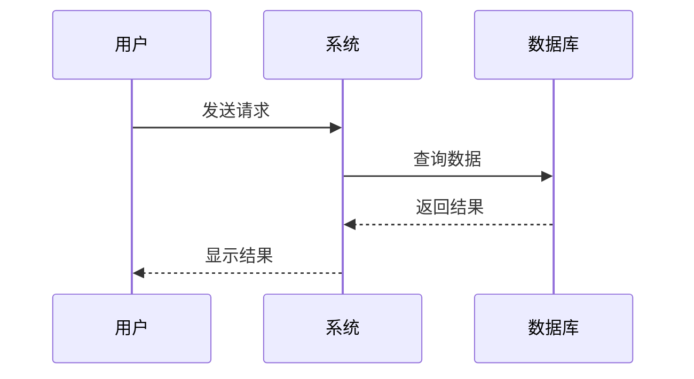
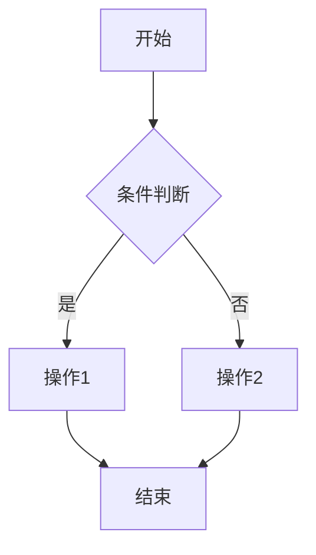

# 写作规范参考文档

本文档为技术书籍写作系统的内置默认规范。如果项目中存在自定义的 `技术书籍写作规范.md`，将优先使用自定义规范。

## 章节结构模板

每个章节必须包含以下标准结构：

```markdown
# 第X章 章节标题

## 本章导读
- 本章要解决什么问题
- 为什么需要学习这个内容
- 学完本章你将掌握什么

## 核心概念
### X.1 概念一
- **极简定义** (一句话说清楚)
- **本质解释** (用类比或实例说明)
- **应用场景** (什么时候用)

### X.2 概念二
...

## 原理解析
### X.X.1 时序图/流程图
(必须包含可视化图表)

### X.X.2 对比表格
(必须使用表格对比不同方案/技术)

## 实战案例
### X.X.X 典型场景
- **场景描述**
- **完整代码** (可直接运行)
- **代码详解** (逐行注释)
- **运行结果**
- **常见问题**

## 本章小结
- 核心要点回顾(3-5条)
- 知识点关联图

## 章节测试
- 选择题(5题)
- 简答题(3题)
- 编程题(2题)

## 参考答案
(完整答案和解析)
```

## 写作原则

### 1. 第一性原理
从最基础的原理出发，不预设读者有任何先验知识。

### 2. 极简表达
用最少的字说清楚问题，避免冗余。

**示例**：
- ❌ "在深度学习领域中，神经网络是一种..."
- ✅ "神经网络就是模拟大脑的计算模型"

### 3. 日常化语言
避免学术术语堆砌，使用读者能理解的语言。

**示例**：
- ❌ "该算法具有较高的时间复杂度"
- ✅ "这个算法比较慢"

### 4. 实战导向
理论必须与实践结合，每个概念都要有对应的代码示例。

## 章节规模控制

- **单章字数**: 5000-8000字
- **阅读时长**: 30-45分钟
- **代码示例**: 2-4个完整案例
- **图表数量**: 3-6个（时序图/流程图/对比表）

## 代码规范

### 完整性原则
- ✅ 可以直接复制运行
- ✅ 包含所有必要的导入
- ✅ 提供测试数据
- ✅ 显示运行结果

### 代码模板

```python
"""
案例名称: XXX
功能说明: 一句话说明这段代码做什么
适用场景: 什么时候用
"""

# 1. 导入必要的库
import numpy as np

# 2. 准备测试数据
data = [1, 2, 3, 4, 5]

# 3. 核心逻辑（每个关键步骤都要注释）
def process_data(input_data):
    """
    函数功能: xxx
    
    参数:
        input_data: 输入数据说明
    
    返回:
        result: 返回结果说明
    """
    # 步骤1: xxx
    step1 = np.array(input_data)
    
    # 步骤2: xxx
    result = step1.mean()
    
    return result

# 4. 运行示例
if __name__ == "__main__":
    result = process_data(data)
    print(f"结果: {result}")

# 预期输出:
# 结果: 3.0
```

### 代码长度控制
- **单个代码块**: ≤ 50行
- **复杂示例**: 分段展示，逐步构建

## 插图规范

### 必须包含的图表类型

#### 1. 时序图（Mermaid）
展示系统交互流程。



#### 2. 流程图（Mermaid）
展示算法或业务流程。



#### 3. 对比表格（Markdown）

```markdown
| 技术/方案 | 优点 | 缺点 | 适用场景 |
|----------|------|------|---------|
| 方案A    | xxx  | xxx  | xxx     |
| 方案B    | xxx  | xxx  | xxx     |
```

## 测试题规范

### 题型分配

| 题型 | 数量 | 分值 | 目的 |
|------|------|------|------|
| 选择题 | 5题 | 各2分 | 考察基础概念 |
| 简答题 | 3题 | 各10分 | 考察理解深度 |
| 编程题 | 2题 | 各25分 | 考察实战能力 |

### 选择题示例

```markdown
1. 以下哪个是监督学习的典型应用？
   A. 图像分类 ✓
   B. 聚类分析
   C. 降维处理
   D. 异常检测
   
答案: A
解析: 监督学习需要标注数据，图像分类属于有标签的分类任务。
```

### 简答题示例

```markdown
2. 请简述梯度下降算法的核心思想。

参考答案:
梯度下降通过计算损失函数的梯度，沿着梯度的反方向更新参数，逐步找到最优解。
关键点：
- 计算梯度（导数）
- 反方向更新
- 学习率控制步长
- 迭代直到收敛
```

### 编程题示例

```markdown
3. 使用NumPy实现一个简单的线性回归模型。

参考答案:
[提供完整可运行代码]
```

## 质量检查清单

### 每章完成后自检

- [ ] 核心概念是否用一句话说清楚了？
- [ ] 是否包含至少2个时序图/流程图？
- [ ] 是否有对比表格展示不同方案？
- [ ] 代码示例是否可以直接运行？
- [ ] 是否添加了足够的代码注释？
- [ ] 是否避免了过度深入的理论？
- [ ] 测试题是否覆盖本章核心知识点？
- [ ] 语言风格是否简洁易懂？
- [ ] 单章字数是否在5000-8000之间？

## 技术栈时效性

使用2025年主流技术栈。

### Python技术栈
```python
Python: 3.11+
NumPy: 1.26+
Pandas: 2.2+
Matplotlib: 3.8+
PyTorch: 2.2+
TensorFlow: 2.15+
```

### 前端技术栈
```
Node.js: 20.x LTS
React: 18.x
Vue: 3.x
TypeScript: 5.x
```

### 后端技术栈
```
Go: 1.22+
Gin: 1.9+
GORM: 2.x
```

## 阮一峰写作风格

### 核心特征

1. **极简表达**: 用最少的字说清楚问题
2. **日常化语言**: 避免学术术语堆砌
3. **类比思维**: 用生活常识解释技术
4. **分点叙述**: 多用列表，少用长段落
5. **留白设计**: 适当的空行和分隔

### 具体示例

**传统写法**：
```
在深度学习领域，卷积神经网络（Convolutional Neural Network, CNN）
是一种专门用于处理具有网格结构数据的深度学习模型，其核心思想是
通过卷积层提取特征...
```

**阮一峰风格**：
```
CNN 就是处理图片的神经网络。

为什么叫"卷积"？因为它像扫描仪一样，用一个小窗口在图片上滑动，
提取特征。

类比：就像你看一张照片，先注意边缘、颜色、形状，最后才认出是什么。
```

## 禁止事项

- ❌ 长篇大论的理论推导
- ❌ 晦涩的数学公式（除非必要）
- ❌ 没有代码的纯理论讲解
- ❌ 过时的技术栈（2024年以前）
- ❌ 没有注释的代码示例
- ❌ 超过100行的代码块

---

最后更新: 2026-02-06
